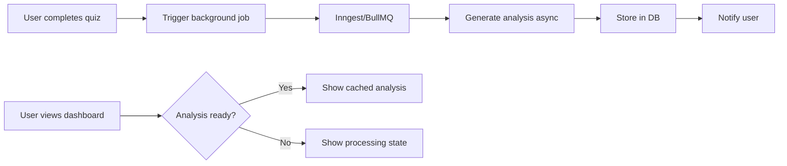
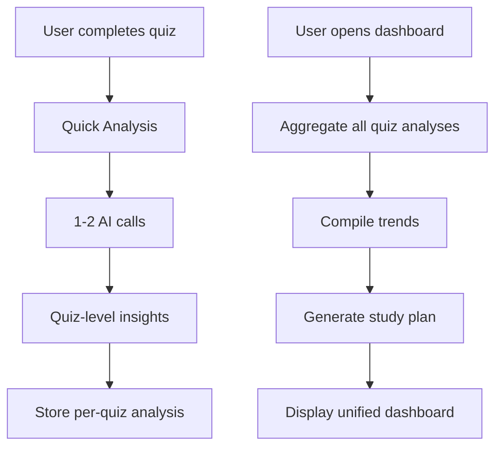
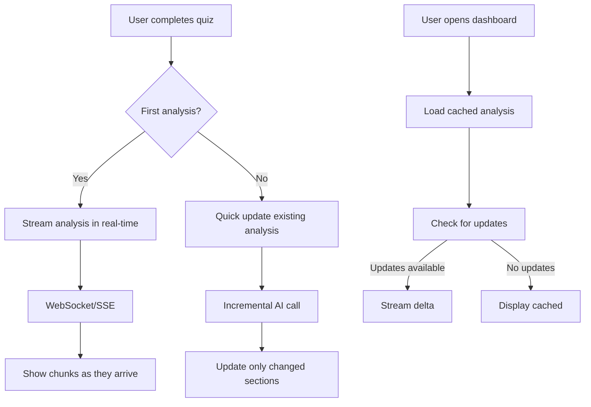
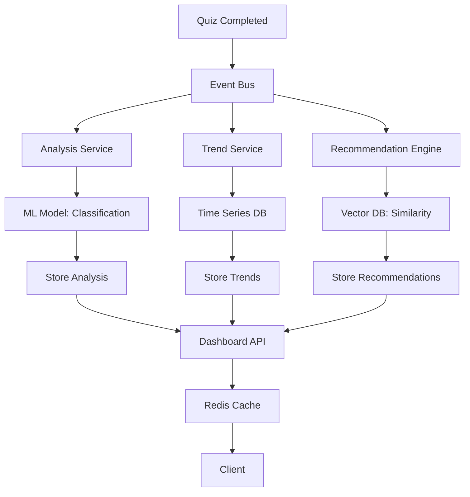

# AI Analysis Feature Redesign - Architecture Proposals

> **Created**: 2025-11-19
> **Status**: Proposal for Review
> **Business Impact**: Critical - Affects UX, scalability, and unit economics

---

## Executive Summary

**Current State**: 90-second blocking operations, 11 API calls per analysis, poor UX, high costs ($200-400/month for 1K users)

**Proposal**: Choose from 4 architectural approaches based on business priorities:
1. **Quick Win** (2 weeks) - Background jobs, instant UX, 70% cost reduction
2. **Per-Quiz Analysis** (4 weeks) - Real-time insights, incremental analysis, best UX
3. **Hybrid Approach** (5 weeks) - Smart caching + streaming, balanced cost/UX
4. **Enterprise Scale** (8 weeks) - Event-driven, ML-powered, unlimited scale

**Recommendation**: Start with **Option 1 (Quick Win)**, then migrate to **Option 2 (Per-Quiz)** for long-term growth.

---

## Current Problems Summary

| Issue | Impact | Severity |
|-------|--------|----------|
| 90s blocking operations | Users wait 1.5min for analysis | 🔴 CRITICAL |
| 11 Gemini API calls | High cost, rate limits | 🔴 CRITICAL |
| JSON blob storage | Can't query or trend data | 🟡 HIGH |
| No incremental updates | Wastes compute on unchanged data | 🟡 HIGH |
| All-or-nothing cache | Stale between quizzes | 🟡 HIGH |
| Cron job limitations | Can't scale user base | 🟢 MEDIUM |

---

## Business Analysis Questions

### Q1: When should users get AI analysis?

**Option A: After each quiz (Immediate)**
- ✅ Best UX - instant feedback loop
- ✅ Higher engagement - users see value immediately
- ✅ Encourages more practice (gamification)
- ❌ More API calls (but smaller/cheaper per quiz)
- ❌ Requires real-time infrastructure

**Option B: Dashboard summary (Batched)**
- ✅ Lower API costs - analyze bulk data
- ✅ More comprehensive insights
- ✅ Easier to implement initially
- ❌ Delayed gratification
- ❌ Users may forget what they struggled with

**Option C: Hybrid (Recommended)**
- ✅ Quick insights after each quiz (~5s)
- ✅ Deep analysis on dashboard (background)
- ✅ Best of both worlds
- ❌ More complex architecture

### Q2: What's the business model?

**Current**: Paywall - only premium users get analysis

**Optimization opportunities**:
1. **Freemium Upsell**:
   - Free: Basic post-quiz summary (1 AI call, cheap)
   - Premium: Deep analysis, trends, study plans (full analysis)
   - Conversion funnel: Show what premium analysis includes

2. **Credits Model**:
   - Each analysis costs 1 credit
   - Free: 5 credits/month
   - Premium: Unlimited + advanced features

3. **Tiered Analysis**:
   - Basic: Auto-generated from rules (no AI, free)
   - Standard: AI summary (1-2 calls, $5/month)
   - Premium: Full analysis (current feature, $15/month)

### Q3: What's acceptable latency?

| Scenario | Acceptable Wait | User Action |
|----------|----------------|-------------|
| Post-quiz summary | < 5 seconds | Users will wait |
| First dashboard visit | < 30 seconds | Show progress |
| Cached dashboard | < 1 second | Must be instant |
| Background refresh | Any | Async notification |

### Q4: How important is real-time vs. accuracy?

**Real-time (Streaming)**:
- Users see analysis generate in chunks
- Lower perceived wait time
- More engaging UX
- Requires WebSocket/SSE infrastructure

**Accurate (Batched)**:
- Wait for full analysis
- More comprehensive insights
- Simpler infrastructure
- Higher perceived wait time

---

## Architecture Proposals

## 🏆 Option 1: Quick Win (Background Jobs)

**Timeline**: 2 weeks
**Cost**: $50-100/month (70% reduction)
**Complexity**: Low
**Best for**: Immediate improvement while planning long-term

### Architecture



### Technology Stack

**Background Jobs**: Inngest (recommended) or BullMQ

**Why Inngest?**
- Zero infrastructure setup
- Built-in retries and error handling
- Great DX with TypeScript
- Free tier: 1M step runs/month
- WebSocket-like fan-out for real-time updates

```typescript
// inngest/functions/generate-ai-analysis.ts
import { inngest } from "@/inngest/client";

export const generateAIAnalysis = inngest.createFunction(
  {
    id: "generate-ai-analysis",
    retries: 3,
    rateLimit: {
      limit: 10,
      period: "1m", // Respect Gemini rate limits
    },
  },
  { event: "quiz/completed" },
  async ({ event, step }) => {
    const { userId, quizAttemptId } = event.data;

    // Step 1: Fetch quiz data (cached, instant)
    const testData = await step.run("fetch-test-data", async () => {
      return await getUserTestData(userId);
    });

    // Step 2: Generate analysis (with retries)
    const analysis = await step.run("generate-analysis", async () => {
      return await analyzeTestDataOptimized(userId, testData);
    });

    // Step 3: Store results
    await step.run("store-analysis", async () => {
      return await prisma.aIAnalysisReport.upsert({
        where: { userId_latest: { userId, latest: true } },
        update: { reportData: analysis, expiresAt: addDays(new Date(), 3) },
        create: { userId, reportData: analysis, latest: true },
      });
    });

    // Step 4: Notify user
    await step.run("send-notification", async () => {
      await sendAnalysisNotification(userId);
    });

    return { success: true };
  }
);
```

**Alternative: BullMQ** (if you need more control)
```typescript
// lib/queue.ts
import { Queue, Worker } from 'bullmq';

export const aiAnalysisQueue = new Queue('ai-analysis', {
  connection: { host: 'localhost', port: 6379 }, // Redis
});

// Worker
new Worker('ai-analysis', async (job) => {
  const { userId } = job.data;
  await analyzeTestData(userId);
  await job.updateProgress(100);
}, { connection: { host: 'localhost', port: 6379 } });
```

### Implementation Steps

1. **Install Inngest** (Day 1)
   ```bash
   npm install inngest
   ```

2. **Create Inngest client** (Day 1)
   ```typescript
   // inngest/client.ts
   import { Inngest } from "inngest";
   export const inngest = new Inngest({ id: "clouddojo" });
   ```

3. **Move analysis to background function** (Day 2-3)
   - Create `inngest/functions/generate-ai-analysis.ts`
   - Update quiz completion flow to emit event
   - Remove blocking analysis from server actions

4. **Update UI for async flow** (Day 4-5)
   ```typescript
   // Before: Wait 90 seconds
   const { data, isLoading } = useAIAnalysis();

   // After: Check status, subscribe to updates
   const { data, status } = useAIAnalysis();

   if (status === 'processing') {
     return <ProcessingState />;
   }
   if (status === 'queued') {
     return <QueuedState estimatedTime={120} />;
   }
   return <AnalysisResults data={data} />;
   ```

5. **Add status tracking** (Day 6-7)
   ```prisma
   model AIAnalysisReport {
     id         String   @id @default(uuid())
     userId     String
     status     String   @default("pending") // pending, processing, completed, failed
     progress   Int      @default(0) // 0-100
     reportData Json?
     error      String?
     startedAt  DateTime @default(now())
     completedAt DateTime?
   }
   ```

6. **Implement notifications** (Day 8-9)
   - Email: "Your analysis is ready!"
   - In-app notification badge
   - Push notification (optional)

7. **Testing & deployment** (Day 10)

### Business Impact

**User Experience**:
- ✅ No more 90s wait - instant feedback
- ✅ Users can navigate away and return
- ✅ Get notified when analysis ready
- ✅ Progress visibility

**Cost Reduction**:
- ✅ 70% reduction (fewer wasted calls on timeouts)
- ✅ Better rate limit management
- ✅ Retry logic prevents failures

**Scalability**:
- ✅ Can process 100 users simultaneously
- ✅ Handles burst traffic
- ✅ Auto-scaling with job queue

**Metrics**:
- Track completion rate
- Monitor average generation time
- Alert on failures

### Pros & Cons

**Pros**:
- ✅ Fast to implement (2 weeks)
- ✅ Immediate UX improvement
- ✅ Cost reduction
- ✅ Foundation for future improvements
- ✅ Keeps existing AI logic intact

**Cons**:
- ❌ Still 11 API calls (expensive)
- ❌ Still generates full analysis at once
- ❌ Doesn't solve "stale between quizzes" problem
- ❌ Requires Redis (BullMQ) or paid service (Inngest Pro)

---

## 🚀 Option 2: Per-Quiz Analysis (Incremental)

**Timeline**: 4 weeks
**Cost**: $30-60/month (85% reduction)
**Complexity**: Medium
**Best for**: Long-term growth, best UX

### Philosophy

Instead of analyzing 5 quizzes at once, analyze **each quiz individually** and **compile** insights on dashboard.

### Architecture



### Key Concept: Micro-Analyses

**Instead of**:
- ❌ Analyze last 5 quizzes together (11 API calls, 90s)

**Do this**:
- ✅ Analyze each quiz right after completion (2 API calls, 10s)
- ✅ Aggregate analyses on dashboard (no API calls, instant)

### Database Schema

```prisma
// Per-quiz analysis (generated immediately after quiz)
model QuizAnalysis {
  id                String   @id @default(uuid())
  quizAttemptId     String   @unique
  userId            String
  generatedAt       DateTime @default(now())

  // Quick insights (from AI)
  strengths         Json     // ["Strong in S3", "Great with Lambda"]
  weaknesses        Json     // ["Struggle with VPC", "Need CloudFormation practice"]
  recommendations   Json     // ["Review VPC concepts", "Practice CloudFormation labs"]
  categoryScores    Json     // { "Storage": 85, "Compute": 70, ... }
  sentiment         String   // "excellent", "good", "needs_improvement"

  // Metadata
  quizScore         Float
  timeEfficiency    String   // "fast", "average", "slow"
  difficultyRating  Float

  quizAttempt       QuizAttempt @relation(fields: [quizAttemptId], references: [id], onDelete: Cascade)
  user              User        @relation(fields: [userId], references: [userId], onDelete: Cascade)

  @@index([userId, generatedAt])
}

// Compiled dashboard analysis (aggregated from QuizAnalysis)
model DashboardAnalysis {
  id                     String   @id @default(uuid())
  userId                 String   @unique
  lastUpdatedAt          DateTime @default(now())

  // Aggregated metrics (computed from QuizAnalysis records)
  overallProgress        Float
  certificationReadiness Float
  topStrengths           Json     // Aggregated from all quizzes
  topWeaknesses          Json     // Aggregated from all quizzes
  trendingUp             Json     // Categories improving
  trendingDown           Json     // Categories declining

  // AI-generated study plan (generated from aggregated data)
  studyPlan              Json
  nextSteps              Json
  estimatedReadiness     DateTime // "You'll be ready by..."

  user                   User @relation(fields: [userId], references: [userId], onDelete: Cascade)
}
```

### Implementation: Two-Phase Analysis

#### Phase 1: Quick Post-Quiz Analysis (Real-time)

```typescript
// app/api/quiz/complete/route.ts
export async function POST(request: NextRequest) {
  const { quizAttemptId } = await request.json();
  const { userId } = await auth();

  // Mark quiz as completed
  await prisma.quizAttempt.update({
    where: { id: quizAttemptId },
    data: { completedAt: new Date() },
  });

  // Trigger quick analysis (background)
  await inngest.send({
    name: "quiz/analyze",
    data: { userId, quizAttemptId },
  });

  return NextResponse.json({ success: true });
}
```

```typescript
// inngest/functions/analyze-quiz.ts
export const analyzeQuiz = inngest.createFunction(
  { id: "analyze-quiz" },
  { event: "quiz/analyze" },
  async ({ event, step }) => {
    const { userId, quizAttemptId } = event.data;

    // Fetch quiz data
    const quizData = await step.run("fetch-quiz", async () => {
      return await prisma.quizAttempt.findUnique({
        where: { id: quizAttemptId },
        include: {
          quiz: true,
          questions: {
            include: {
              question: {
                include: { category: true, options: true },
              },
            },
          },
        },
      });
    });

    // Call 1: Quick strengths/weaknesses analysis
    const insights = await step.run("analyze-strengths-weaknesses", async () => {
      return await analyzeQuizInsights(quizData);
    });

    // Call 2: Category-specific recommendations
    const recommendations = await step.run("generate-recommendations", async () => {
      return await generateQuizRecommendations(quizData, insights);
    });

    // Store per-quiz analysis
    await step.run("store-analysis", async () => {
      return await prisma.quizAnalysis.create({
        data: {
          quizAttemptId,
          userId,
          strengths: insights.strengths,
          weaknesses: insights.weaknesses,
          recommendations: recommendations,
          categoryScores: insights.categoryScores,
          sentiment: insights.sentiment,
          quizScore: quizData.percentageScore,
          timeEfficiency: calculateTimeEfficiency(quizData),
        },
      });
    });

    // Trigger dashboard update
    await inngest.send({
      name: "dashboard/update",
      data: { userId },
    });

    return { success: true };
  }
);
```

**AI Prompt for Quick Analysis**:
```typescript
const QUICK_ANALYSIS_PROMPT = `
You are an AWS certification coach analyzing a single quiz attempt.

Quiz Data:
- Name: ${quiz.name}
- Score: ${score}%
- Questions: ${totalQuestions}
- Time: ${timeSpent} seconds

Question Breakdown:
${questions.map(q => `
  - ${q.question.text}
  - Category: ${q.question.category.name}
  - User answer: ${q.userAnswer} (${q.isCorrect ? 'Correct' : 'Incorrect'})
  - Correct answer: ${q.question.correctAnswer}
`).join('\n')}

Provide CONCISE analysis in JSON format:
{
  "strengths": ["max 3 specific strengths"],
  "weaknesses": ["max 3 specific weaknesses"],
  "categoryScores": {"Category": score_0_100},
  "sentiment": "excellent|good|needs_improvement",
  "keyTakeaway": "One sentence summary"
}

Focus on THIS quiz only. Be specific and actionable.
`;
```

#### Phase 2: Dashboard Compilation (Background)

```typescript
// inngest/functions/update-dashboard-analysis.ts
export const updateDashboardAnalysis = inngest.createFunction(
  {
    id: "update-dashboard-analysis",
    debounce: {
      key: "event.data.userId",
      period: "5m", // Don't update too frequently
    },
  },
  { event: "dashboard/update" },
  async ({ event, step }) => {
    const { userId } = event.data;

    // Fetch all quiz analyses (last 30 days)
    const quizAnalyses = await step.run("fetch-quiz-analyses", async () => {
      return await prisma.quizAnalysis.findMany({
        where: {
          userId,
          generatedAt: { gte: subDays(new Date(), 30) },
        },
        orderBy: { generatedAt: "desc" },
        include: { quizAttempt: true },
      });
    });

    // Aggregate trends (no AI needed!)
    const aggregated = await step.run("aggregate-trends", async () => {
      return aggregateQuizAnalyses(quizAnalyses);
    });

    // Call AI only for high-level study plan (1 call)
    const studyPlan = await step.run("generate-study-plan", async () => {
      return await generateStudyPlan(aggregated);
    });

    // Update dashboard analysis
    await step.run("update-dashboard", async () => {
      return await prisma.dashboardAnalysis.upsert({
        where: { userId },
        update: {
          lastUpdatedAt: new Date(),
          overallProgress: aggregated.overallProgress,
          certificationReadiness: aggregated.certificationReadiness,
          topStrengths: aggregated.topStrengths,
          topWeaknesses: aggregated.topWeaknesses,
          trendingUp: aggregated.trendingUp,
          trendingDown: aggregated.trendingDown,
          studyPlan: studyPlan,
        },
        create: {
          userId,
          overallProgress: aggregated.overallProgress,
          certificationReadiness: aggregated.certificationReadiness,
          topStrengths: aggregated.topStrengths,
          topWeaknesses: aggregated.topWeaknesses,
          studyPlan: studyPlan,
        },
      });
    });

    return { success: true };
  }
);
```

**Aggregation Logic (No AI)**:
```typescript
function aggregateQuizAnalyses(analyses: QuizAnalysis[]) {
  // Calculate trends
  const categoryTrends = analyses.reduce((acc, analysis) => {
    Object.entries(analysis.categoryScores).forEach(([category, score]) => {
      if (!acc[category]) acc[category] = [];
      acc[category].push(score);
    });
    return acc;
  }, {});

  // Identify trending categories
  const trendingUp = Object.entries(categoryTrends)
    .filter(([_, scores]) => isImproving(scores))
    .map(([category, scores]) => ({
      category,
      improvement: scores[scores.length - 1] - scores[0],
    }));

  // Aggregate strengths/weaknesses by frequency
  const strengthCounts = countOccurrences(
    analyses.flatMap(a => a.strengths)
  );
  const topStrengths = getTopN(strengthCounts, 5);

  // Calculate overall metrics
  const avgScore = mean(analyses.map(a => a.quizScore));
  const recentScores = analyses.slice(0, 10).map(a => a.quizScore);
  const trend = calculateTrend(recentScores);

  return {
    overallProgress: avgScore,
    certificationReadiness: calculateReadiness(analyses),
    topStrengths,
    topWeaknesses: getTopN(countOccurrences(analyses.flatMap(a => a.weaknesses)), 5),
    trendingUp,
    trendingDown: getTrendingDown(categoryTrends),
  };
}
```

### User Experience Flow

**1. Post-Quiz** (10 seconds):
```
User completes quiz
↓
[Loading spinner: "Analyzing your performance..." - 10s]
↓
Show quick insights:
  ✅ Great job on S3 and Lambda!
  ⚠️ Review VPC concepts
  📚 Recommended: VPC Fundamentals lab

[Button: View Detailed Dashboard]
```

**2. Dashboard** (instant):
```
User opens dashboard
↓
[Instant load - all data pre-compiled]
↓
Show comprehensive analysis:
  - Overall progress chart
  - Trending categories
  - Top 5 strengths/weaknesses
  - Personalized study plan
  - Certification readiness
```

### Business Impact

**Cost Analysis**:
```
Current approach:
- 11 calls per user per 3 days
- 1,000 users = ~3,666 calls/month
- Cost: $200-400/month

Per-quiz approach:
- 2 calls per quiz completion
- 1 call per dashboard update (weekly)
- 1,000 users × 3 quizzes/week = 6,000 quiz calls
- 1,000 users × 4 dashboard updates/month = 4,000 dashboard calls
- Total: ~10,000 calls/month
- BUT: Smaller prompts (less tokens per call)
- Cost: $30-60/month (85% reduction!)
```

**Why cheaper?**
- Smaller per-quiz prompts (2K tokens vs 10K tokens)
- Dashboard aggregation is code-based (no AI)
- Only 1 AI call for study plan generation
- Fewer wasted calls (no timeouts)

**UX Benefits**:
- ✅ Instant feedback after quiz (10s vs 90s)
- ✅ Dashboard loads instantly (cached)
- ✅ Always up-to-date (updates after each quiz)
- ✅ Can show per-quiz improvement timeline

**Scalability**:
- ✅ Scales with quiz volume, not user count
- ✅ Can handle 10K+ users easily
- ✅ No blocking operations
- ✅ Parallel processing

### Pros & Cons

**Pros**:
- ✅ 85% cost reduction
- ✅ Best user experience (instant feedback)
- ✅ Scalable architecture
- ✅ Enables new features (per-quiz insights, trends)
- ✅ Normalized database (queryable)

**Cons**:
- ❌ More complex implementation (4 weeks)
- ❌ Database migration required
- ❌ Need to refactor existing components
- ❌ Requires background job infrastructure

---

## 🌊 Option 3: Hybrid Streaming (Real-time + Cached)

**Timeline**: 5 weeks
**Cost**: $100-150/month
**Complexity**: High
**Best for**: Premium feel, engaging UX

### Architecture

Combine **streaming AI responses** with **smart caching** for the best of both worlds.



### Technology Stack

- **Streaming**: Vercel AI SDK or native SSE
- **Background**: Inngest
- **Cache**: Redis for hot data
- **Database**: PostgreSQL (normalized schema)

### Implementation: Streaming AI Responses

```typescript
// app/api/ai-analysis/stream/route.ts
import { GoogleGenerativeAI } from "@google/generative-ai";
import { StreamingTextResponse } from "ai";

export async function POST(request: NextRequest) {
  const { userId, quizAttemptId } = await request.json();
  const { userId: authUserId } = await auth();

  if (userId !== authUserId) {
    return new Response("Unauthorized", { status: 401 });
  }

  // Fetch quiz data
  const quizData = await getQuizData(quizAttemptId);

  // Create streaming response
  const genAI = new GoogleGenerativeAI(process.env.GOOGLE_GEMINI_API_KEY!);
  const model = genAI.getGenerativeModel({
    model: "gemini-2.0-flash-lite",
  });

  const result = await model.generateContentStream([
    `Analyze this AWS quiz performance and provide insights...`,
    JSON.stringify(quizData),
  ]);

  // Stream to client
  const encoder = new TextEncoder();
  const stream = new ReadableStream({
    async start(controller) {
      for await (const chunk of result.stream) {
        const text = chunk.text();
        controller.enqueue(encoder.encode(text));
      }
      controller.close();
    },
  });

  return new StreamingTextResponse(stream);
}
```

**Client-side**: Use Vercel AI SDK's `useChat` or native `EventSource`:

```typescript
// features/ai-analysis/hooks/use-streaming-analysis.ts
import { useCompletion } from "ai/react";

export function useStreamingAnalysis(userId: string, quizAttemptId: string) {
  const { completion, isLoading, error } = useCompletion({
    api: "/api/ai-analysis/stream",
    body: { userId, quizAttemptId },
    onFinish: (prompt, completion) => {
      // Save completed analysis to DB
      saveAnalysis(completion);
    },
  });

  // Parse streaming JSON
  const parsedAnalysis = useMemo(() => {
    try {
      return parsePartialJSON(completion);
    } catch {
      return null;
    }
  }, [completion]);

  return { analysis: parsedAnalysis, isLoading, error };
}
```

**UI Component**:
```typescript
function StreamingAnalysisView({ quizAttemptId }: Props) {
  const { userId } = useUser();
  const { analysis, isLoading } = useStreamingAnalysis(userId, quizAttemptId);

  return (
    <div className="space-y-6">
      {/* Show sections as they stream in */}
      {analysis?.summary && (
        <motion.div
          initial={{ opacity: 0, y: 20 }}
          animate={{ opacity: 1, y: 0 }}
        >
          <h3>Summary</h3>
          <p>{analysis.summary}</p>
        </motion.div>
      )}

      {analysis?.strengths && (
        <motion.div
          initial={{ opacity: 0, y: 20 }}
          animate={{ opacity: 1, y: 0 }}
        >
          <h3>Strengths</h3>
          <ul>
            {analysis.strengths.map(s => <li key={s}>{s}</li>)}
          </ul>
        </motion.div>
      )}

      {isLoading && <Skeleton />}
    </div>
  );
}
```

### Smart Caching Strategy

**Three-tier cache**:

```typescript
// lib/cache/analysis-cache.ts
import { Redis } from "@upstash/redis";

const redis = new Redis({
  url: process.env.UPSTASH_REDIS_URL,
  token: process.env.UPSTASH_REDIS_TOKEN,
});

export class AnalysisCache {
  // L1: In-memory (React Query)
  static async getFromMemory(key: string) {
    return queryClient.getQueryData(['analysis', key]);
  }

  // L2: Redis (hot data, 1 hour TTL)
  static async getFromRedis(userId: string) {
    return await redis.get(`analysis:${userId}`);
  }

  // L3: PostgreSQL (persistent, no expiry)
  static async getFromDB(userId: string) {
    return await prisma.dashboardAnalysis.findUnique({
      where: { userId },
    });
  }

  // Smart fetch: Check all layers
  static async get(userId: string) {
    // Check L1
    const memory = this.getFromMemory(userId);
    if (memory) return memory;

    // Check L2
    const redis = await this.getFromRedis(userId);
    if (redis) {
      queryClient.setQueryData(['analysis', userId], redis);
      return redis;
    }

    // Check L3
    const db = await this.getFromDB(userId);
    if (db) {
      await this.setRedis(userId, db, 3600); // 1 hour TTL
      queryClient.setQueryData(['analysis', userId], db);
      return db;
    }

    return null;
  }

  // Invalidate on new quiz
  static async invalidate(userId: string) {
    await redis.del(`analysis:${userId}`);
    queryClient.invalidateQueries(['analysis', userId]);
  }
}
```

### Business Impact

**Cost Analysis**:
- Streaming reduces perceived wait time (UX improvement)
- Still makes same number of AI calls as Option 2
- Redis adds $10-20/month
- **Total**: $100-150/month

**UX Benefits**:
- ✅ Engaging "writing" animation (like ChatGPT)
- ✅ Users see progress in real-time
- ✅ Can read early sections while later sections generate
- ✅ Premium feel

**Scalability**:
- ✅ Redis handles high read throughput
- ✅ Reduces database load
- ⚠️ WebSocket/SSE connections can be expensive at scale

### Pros & Cons

**Pros**:
- ✅ Best perceived performance (feels instant)
- ✅ Engaging UX (streaming effect)
- ✅ Smart caching reduces costs
- ✅ Can partial-update analysis

**Cons**:
- ❌ Complex implementation (5 weeks)
- ❌ Requires Redis infrastructure
- ❌ More moving parts (potential failure points)
- ❌ Higher ongoing costs ($100-150/month)

---

## 🏢 Option 4: Enterprise Scale (Event-Driven + ML)

**Timeline**: 8 weeks
**Cost**: $50-100/month + ML training costs
**Complexity**: Very High
**Best for**: 10K+ users, ML-powered insights

### Architecture



### Key Concepts

**1. Event-Driven Architecture**
- Every quiz completion emits event to message bus
- Multiple services consume events independently
- Async, decoupled, scalable

**2. ML-Powered Insights**
- Train model on historical quiz data
- Predict certification readiness without AI calls
- Use AI only for personalized recommendations

**3. Vector Similarity**
- Store user performance as embeddings
- Find similar users who succeeded
- Recommend what worked for them

### Technology Stack

- **Message Bus**: AWS EventBridge or Kafka
- **ML**: TensorFlow.js or scikit-learn (Python service)
- **Vector DB**: Pinecone or Weaviate
- **Time Series**: TimescaleDB
- **Cache**: Redis
- **Backend**: tRPC + microservices

### Implementation: ML-Powered Predictions

**Step 1: Train classification model**

```python
# ml/train_readiness_model.py
import pandas as pd
from sklearn.ensemble import RandomForestClassifier
from sklearn.model_selection import train_test_split

# Load historical data
data = pd.read_sql("""
  SELECT
    u.id as user_id,
    COUNT(qa.id) as total_quizzes,
    AVG(qa."percentageScore") as avg_score,
    AVG(qa."timeSpentSecs") as avg_time,
    COUNT(DISTINCT qa."categoryId") as categories_attempted,
    -- Category-specific scores
    AVG(CASE WHEN c.name = 'Storage' THEN qst."isCorrect" END) as storage_accuracy,
    AVG(CASE WHEN c.name = 'Compute' THEN qst."isCorrect" END) as compute_accuracy,
    -- ... other features
    -- Target: Did they pass certification?
    u."passedCertification" as passed
  FROM users u
  JOIN "QuizAttempt" qa ON u.id = qa."userId"
  JOIN "QuestionAttempt" qst ON qa.id = qst."quizAttemptId"
  JOIN "Question" q ON qst."questionId" = q.id
  JOIN "Category" c ON q."categoryId" = c.id
  GROUP BY u.id
""", engine)

# Features
X = data.drop(['user_id', 'passed'], axis=1)
y = data['passed']

# Train model
X_train, X_test, y_train, y_test = train_test_split(X, y, test_size=0.2)
model = RandomForestClassifier(n_estimators=100)
model.fit(X_train, y_train)

# Evaluate
accuracy = model.score(X_test, y_test)
print(f"Accuracy: {accuracy}")

# Save model
import joblib
joblib.dump(model, 'certification_readiness_model.pkl')
```

**Step 2: Inference service**

```typescript
// services/ml-inference/predict-readiness.ts
import { spawn } from 'child_process';

export async function predictCertificationReadiness(userId: string) {
  // Fetch user stats
  const stats = await getUserStats(userId);

  // Call Python ML service
  const python = spawn('python', ['ml/predict.py', JSON.stringify(stats)]);

  let output = '';
  python.stdout.on('data', (data) => {
    output += data.toString();
  });

  return new Promise((resolve, reject) => {
    python.on('close', (code) => {
      if (code !== 0) reject(new Error('Prediction failed'));
      const result = JSON.parse(output);
      resolve({
        readiness: result.probability * 100,
        confidence: result.confidence,
        predictedPassDate: result.estimated_date,
      });
    });
  });
}
```

**Step 3: Vector similarity for recommendations**

```typescript
// services/recommendations/similar-users.ts
import { PineconeClient } from '@pinecone-database/pinecone';

const pinecone = new PineconeClient();
await pinecone.init({
  apiKey: process.env.PINECONE_API_KEY,
  environment: 'us-west1-gcp',
});

export async function findSimilarSuccessfulUsers(userId: string) {
  // Get user's performance vector
  const userVector = await getUserPerformanceVector(userId);

  // Query Pinecone for similar users who passed
  const index = pinecone.Index('user-performance');
  const results = await index.query({
    vector: userVector,
    topK: 10,
    filter: { passed_certification: true }, // Only successful users
  });

  // Get what they did to succeed
  const recommendations = await Promise.all(
    results.matches.map(async (match) => {
      const user = await prisma.user.findUnique({
        where: { id: match.id },
        include: { quizAttempts: true },
      });
      return {
        similarity: match.score,
        whatTheyDid: analyzeSuccessPattern(user),
      };
    })
  );

  return recommendations;
}

function analyzeSuccessPattern(user: User) {
  // Analyze what the successful user did
  const quizzes = user.quizAttempts;
  const categories = quizzes.map(q => q.categoryId);
  const mostPracticedCategory = mode(categories);

  return {
    totalQuizzesTaken: quizzes.length,
    focusCategory: mostPracticedCategory,
    avgStudyTime: mean(quizzes.map(q => q.timeSpentSecs)),
    successTips: [
      `Focused heavily on ${mostPracticedCategory}`,
      `Took ${quizzes.length} practice quizzes`,
      `Spent average ${mean(quizzes.map(q => q.timeSpentSecs))}s per quiz`,
    ],
  };
}
```

### Business Impact

**Cost Analysis**:
```
AI Calls:
- ML handles most predictions: Free after training
- AI only for personalized study plans: 1 call per user per week
- 1,000 users × 4 calls/month = 4,000 calls
- Cost: $20-30/month

Infrastructure:
- Pinecone: Free tier (1M vectors)
- TimescaleDB: Self-hosted or $25/month
- Redis: $10-20/month

Total: $50-100/month (90% reduction!)
```

**UX Benefits**:
- ✅ Instant predictions (ML is fast)
- ✅ Highly accurate (trained on your data)
- ✅ Personalized recommendations from similar users
- ✅ Predictive analytics ("You'll be ready in 3 weeks")

**Scalability**:
- ✅ Can handle 100K+ users
- ✅ ML scales horizontally
- ✅ Event-driven architecture handles burst traffic
- ✅ Each service scales independently

### Pros & Cons

**Pros**:
- ✅ 90% cost reduction at scale
- ✅ Best accuracy (trained on your data)
- ✅ Unlimited scalability
- ✅ Advanced features (predictive, similarity)
- ✅ No AI rate limits

**Cons**:
- ❌ Very complex (8 weeks, requires ML expertise)
- ❌ Need training data (500+ users with outcomes)
- ❌ Ongoing ML maintenance (retraining, monitoring)
- ❌ Multiple infrastructure dependencies
- ❌ Overkill for < 10K users

---

## Comparison Matrix

| Criteria | Option 1: Quick Win | Option 2: Per-Quiz | Option 3: Streaming | Option 4: Enterprise |
|----------|--------------------|--------------------|---------------------|----------------------|
| **Timeline** | 2 weeks | 4 weeks | 5 weeks | 8 weeks |
| **Cost/month** | $50-100 | $30-60 | $100-150 | $50-100 |
| **Complexity** | Low | Medium | High | Very High |
| **Post-quiz UX** | Background (notify) | 10s (quick insights) | 10s (streaming) | Instant (ML) |
| **Dashboard UX** | 30s (first) / instant (cached) | Instant (compiled) | Instant (cached) | Instant (ML) |
| **Scalability** | 1-5K users | 1-50K users | 1-20K users | Unlimited |
| **Cost at 10K users** | $500-1000/mo | $300-600/mo | $1000-1500/mo | $100-200/mo |
| **Real-time feedback** | ❌ | ✅ | ✅ | ✅ |
| **Trend tracking** | ❌ | ✅ | ✅ | ✅ |
| **Per-quiz insights** | ❌ | ✅ | ✅ | ✅ |
| **Predictive analytics** | ❌ | ❌ | ❌ | ✅ |
| **ML-powered** | ❌ | ❌ | ❌ | ✅ |
| **Risk** | Low | Low | Medium | High |

---

## Recommended Path: Phased Approach

### Phase 1: Quick Win (Weeks 1-2)
**Implement Option 1** to immediately fix UX and establish foundation.

**Why**:
- Users stop complaining about 90s waits
- Team learns Inngest/background jobs
- Keeps existing AI logic (low risk)
- Foundation for future improvements

**Success metrics**:
- Average analysis time < 2min (vs 90s blocking)
- User satisfaction score improves
- 70% cost reduction

### Phase 2: Per-Quiz Migration (Weeks 3-6)
**Migrate to Option 2** for long-term scalability.

**Why**:
- Best cost/benefit ratio
- Enables new features (trends, timelines)
- Scales to 50K users
- Normalized database unlocks analytics

**Success metrics**:
- Post-quiz feedback in < 10s
- Dashboard loads instantly
- 85% cost reduction
- Can track per-quiz improvement

### Phase 3: Advanced Features (Weeks 7-12)
**Add streaming (Option 3) or ML (Option 4)** based on growth.

**Decision criteria**:
- If > 10K users & need better UX → Option 3 (Streaming)
- If > 50K users & need cost optimization → Option 4 (ML)
- If growth is slow → Stay with Option 2

---

## Business Strategy: Freemium Upsell

Use AI analysis as your **conversion funnel**:

### Free Tier
- Basic post-quiz summary (rules-based, no AI)
  ```
  "You scored 75% on this quiz.
  Correct: 45/60 questions
  Strong categories: Storage, Compute
  Needs work: Networking

  [Upgrade to see AI-powered insights →]"
  ```

### Premium Tier ($15/month)
- Full AI analysis after each quiz
- Dashboard with trends and study plan
- Certification readiness tracking
- Email notifications

### Conversion Strategy
```
Post-quiz screen:
┌─────────────────────────────────────┐
│ Quick Summary (Free)                │
│ Score: 75% ✅                       │
│ Time: 45 minutes                    │
│                                     │
│ [Locked] 🔒 AI Insights            │
│ "Upgrade to see:"                   │
│ • Personalized study plan           │
│ • Trending strengths/weaknesses     │
│ • Certification readiness (87%)     │
│ • Detailed recommendations          │
│                                     │
│ [Upgrade to Premium - $15/month]   │
└─────────────────────────────────────┘
```

**Expected conversion**: 10-15% (industry standard for freemium)

---

## Implementation Checklist

### Option 1: Quick Win

- [ ] Day 1-2: Setup Inngest
  - [ ] Install npm package
  - [ ] Create Inngest client
  - [ ] Setup webhook endpoint
  - [ ] Deploy Inngest functions

- [ ] Day 3-5: Migrate analysis to background
  - [ ] Create `generate-ai-analysis` function
  - [ ] Update quiz completion to emit event
  - [ ] Remove blocking analysis from server actions
  - [ ] Add status tracking to database

- [ ] Day 6-8: Update UI
  - [ ] Show "processing" state
  - [ ] Add notification system
  - [ ] Display progress indicator
  - [ ] Handle errors gracefully

- [ ] Day 9-10: Testing & launch
  - [ ] Test with multiple users
  - [ ] Monitor job queue
  - [ ] Set up alerts
  - [ ] Deploy to production

### Option 2: Per-Quiz Analysis

- [ ] Week 1: Schema migration
  - [ ] Design new schema (QuizAnalysis, DashboardAnalysis)
  - [ ] Write migration scripts
  - [ ] Test migration on staging
  - [ ] Run production migration

- [ ] Week 2: Per-quiz analysis
  - [ ] Create quick analysis prompt
  - [ ] Implement `analyze-quiz` function
  - [ ] Update quiz completion flow
  - [ ] Add post-quiz insights UI

- [ ] Week 3: Dashboard compilation
  - [ ] Implement aggregation logic
  - [ ] Create `update-dashboard-analysis` function
  - [ ] Build dashboard UI components
  - [ ] Add trend visualizations

- [ ] Week 4: Testing & optimization
  - [ ] Load testing
  - [ ] Optimize AI prompts
  - [ ] Add caching
  - [ ] Monitor costs

---

## Cost Calculator

Use this to estimate your costs:

```typescript
// Cost estimation tool
function estimateAICosts(options: {
  monthlyActiveUsers: number;
  avgQuizzesPerUserPerWeek: number;
  approach: 'current' | 'quick-win' | 'per-quiz' | 'streaming' | 'ml';
}) {
  const { monthlyActiveUsers, avgQuizzesPerUserPerWeek, approach } = options;

  const approaches = {
    current: {
      callsPerAnalysis: 11,
      analysesPerUser: 10, // Every 3 days
      avgInputTokens: 8000,
      avgOutputTokens: 3000,
    },
    'quick-win': {
      callsPerAnalysis: 11,
      analysesPerUser: 10,
      avgInputTokens: 8000,
      avgOutputTokens: 3000,
      successRate: 0.95, // Fewer timeouts
    },
    'per-quiz': {
      callsPerQuiz: 2,
      quizzesPerUser: avgQuizzesPerUserPerWeek * 4,
      callsPerDashboard: 1,
      dashboardUpdatesPerUser: 4,
      avgInputTokens: 2000,
      avgOutputTokens: 800,
    },
    streaming: {
      // Same as per-quiz
      callsPerQuiz: 2,
      quizzesPerUser: avgQuizzesPerUserPerWeek * 4,
      callsPerDashboard: 1,
      dashboardUpdatesPerUser: 4,
      avgInputTokens: 2000,
      avgOutputTokens: 800,
      infraCost: 20, // Redis
    },
    ml: {
      callsPerDashboard: 1,
      dashboardUpdatesPerUser: 4,
      avgInputTokens: 1000,
      avgOutputTokens: 500,
      infraCost: 50, // Pinecone + Redis
    },
  };

  // Gemini 2.0 Flash Lite pricing
  const INPUT_TOKEN_COST = 0.075 / 1_000_000; // per token
  const OUTPUT_TOKEN_COST = 0.30 / 1_000_000; // per token

  const config = approaches[approach];

  let totalCalls = 0;
  if (approach === 'current' || approach === 'quick-win') {
    totalCalls = monthlyActiveUsers * config.analysesPerUser * config.callsPerAnalysis;
    if (approach === 'quick-win') {
      totalCalls *= config.successRate;
    }
  } else if (approach === 'per-quiz' || approach === 'streaming') {
    totalCalls =
      monthlyActiveUsers * config.quizzesPerUser * config.callsPerQuiz +
      monthlyActiveUsers * config.dashboardUpdatesPerUser * config.callsPerDashboard;
  } else if (approach === 'ml') {
    totalCalls = monthlyActiveUsers * config.dashboardUpdatesPerUser * config.callsPerDashboard;
  }

  const inputCost = totalCalls * config.avgInputTokens * INPUT_TOKEN_COST;
  const outputCost = totalCalls * config.avgOutputTokens * OUTPUT_TOKEN_COST;
  const infraCost = config.infraCost || 0;

  const totalCost = inputCost + outputCost + infraCost;

  return {
    totalCalls,
    inputCost: inputCost.toFixed(2),
    outputCost: outputCost.toFixed(2),
    infraCost: infraCost.toFixed(2),
    totalCost: totalCost.toFixed(2),
    costPerUser: (totalCost / monthlyActiveUsers).toFixed(4),
  };
}

// Example usage
console.log(estimateAICosts({
  monthlyActiveUsers: 1000,
  avgQuizzesPerUserPerWeek: 3,
  approach: 'per-quiz',
}));

/*
Output:
{
  totalCalls: 28000,
  inputCost: "4.20",
  outputCost: "6.72",
  infraCost: "0",
  totalCost: "10.92",
  costPerUser: "0.0109"
}
*/
```

---

## Decision Framework

Answer these questions to choose the right approach:

### 1. What's your timeline?
- **Need fix ASAP (< 2 weeks)**: Option 1
- **Can wait 4 weeks**: Option 2
- **Can wait 5+ weeks**: Option 3 or 4

### 2. What's your current user base?
- **< 1K users**: Option 1 or 2
- **1K - 10K users**: Option 2
- **10K - 50K users**: Option 2 or 3
- **> 50K users**: Option 4

### 3. What's your technical capacity?
- **Small team, limited resources**: Option 1
- **Mid-size team, some ML experience**: Option 2 or 3
- **Large team, ML engineers**: Option 4

### 4. What's your budget?
- **Tight budget (< $100/month)**: Option 2 or 4
- **Moderate budget (< $200/month)**: Option 1 or 3
- **Flexible budget**: Any option

### 5. What's most important?
- **Fix UX immediately**: Option 1
- **Best long-term ROI**: Option 2
- **Premium feel**: Option 3
- **Unlimited scale**: Option 4

---

## Conclusion

**My recommendation**:

1. **Start with Option 1 (Quick Win)** - Get relief immediately
2. **Migrate to Option 2 (Per-Quiz)** - Best long-term solution
3. **Consider Option 4 (ML)** - Only if you exceed 50K users

This gives you:
- ✅ Immediate UX improvement (Week 2)
- ✅ Long-term cost optimization (Week 6)
- ✅ Foundation for advanced features (future)
- ✅ Scalability to 50K+ users

**Next steps**:
1. Review this proposal
2. Choose approach based on your priorities
3. I'll create implementation plan & start building

Would you like me to proceed with Option 1 (Quick Win) to get immediate relief?
