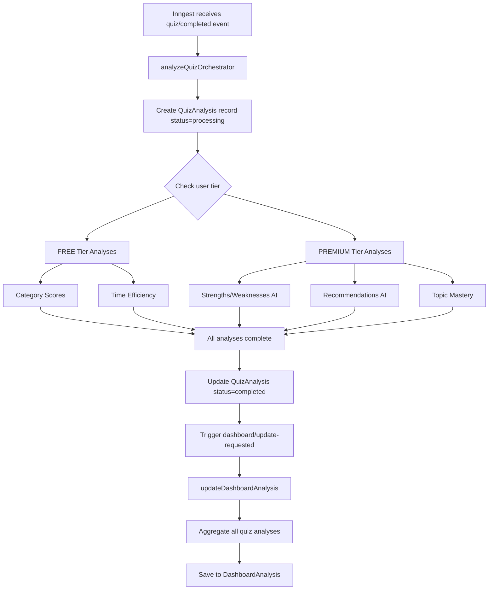
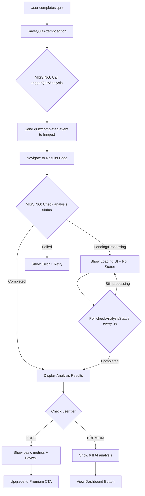

# AI Analysis Frontend Implementation Plan

> **Status**: Ready for Implementation
> **Backend**: ✅ Complete (Inngest + tRPC)
> **Frontend**: 🚧 Components exist, integration needed
> **Timeline**: 2-3 weeks
> **Last Updated**: 2025-11-20

---

## Executive Summary

The AI Analysis backend is **fully implemented** with:
- ✅ Inngest background job processing
- ✅ Per-quiz analysis (2 AI calls per quiz)
- ✅ Dashboard aggregation (code-based, no AI)
- ✅ Freemium tier logic (FREE vs PREMIUM features)
- ✅ tRPC endpoints for all data access
- ✅ UI components built and ready

**What's Missing**: Frontend integration to trigger analysis and display results.

---

## Current State Analysis

### ✅ What Works

| Component | Status | Location |
|-----------|--------|----------|
| **Backend Infrastructure** | ✅ Complete | `/inngest/functions/` |
| **tRPC API Endpoints** | ✅ Complete | `/src/server/routers/analysis.ts` |
| **Database Schema** | ✅ Migrated | `QuizAnalysis`, `DashboardAnalysis`, `TopicMastery` |
| **UI Components** | ✅ Built | `/features/ai-analysis/components/` |
| **Analysis Trigger Function** | ✅ Exists | `app/(actions)/ai-analysis/trigger-quiz-analysis.ts` |
| **Dashboard AI Tab** | ✅ Integrated | `app/dashboard/ai-tab.tsx` |

### ❌ What's Missing

| Gap | Impact | Severity |
|-----|--------|----------|
| Quiz completion → Analysis trigger | Analysis never starts | 🔴 CRITICAL |
| Post-quiz results → Analysis display | Users can't see AI insights | 🔴 CRITICAL |
| Analysis status polling | No real-time feedback | 🟡 HIGH |
| Premium feature gating UI | Unclear free vs paid features | 🟡 HIGH |
| Email notifications | Users don't know when analysis ready | 🟢 MEDIUM |
| Dashboard refresh trigger | Dashboard data may be stale | 🟢 MEDIUM |

---

## Architecture Overview

### Current Backend Flow (✅ Works)



### Missing Frontend Flow (❌ Needs Implementation)



---

## Implementation Plan

### Phase 1: Connect Quiz Completion to Analysis (Week 1)

#### 1.1 Trigger Analysis on Quiz Completion

**File**: `/home/user/clouddojo/app/(actions)/quiz/attempts/save-quiz-attempt.ts`

**Current Code** (lines 39-66):
```typescript
export async function saveQuizAttempt(quizAttemptId: string) {
  // ... validation and data fetching ...

  const quizAttempt = await prisma.quizAttempt.update({
    where: { id: quizAttemptId },
    data: {
      completedAt: new Date(),
      percentageScore,
      isPassed,
      score,
    },
  });

  return { success: true, quizAttempt };
}
```

**Required Change**:
```typescript
import { triggerQuizAnalysis } from "@/app/(actions)/ai-analysis/trigger-quiz-analysis";

export async function saveQuizAttempt(quizAttemptId: string) {
  // ... existing code ...

  const quizAttempt = await prisma.quizAttempt.update({
    where: { id: quizAttemptId },
    data: {
      completedAt: new Date(),
      percentageScore,
      isPassed,
      score,
    },
  });

  // ✅ NEW: Trigger AI analysis in background
  try {
    const userId = await getCurrentUserId();
    await triggerQuizAnalysis(quizAttemptId);
    console.log(`✅ AI analysis triggered for quiz ${quizAttemptId}`);
  } catch (error) {
    console.error("❌ Failed to trigger AI analysis:", error);
    // Don't fail the quiz save if analysis trigger fails
  }

  return { success: true, quizAttempt };
}
```

**Impact**: Every quiz completion now triggers background analysis.

---

#### 1.2 Create Analysis Status Checker Component

**New File**: `/home/user/clouddojo/features/ai-analysis/components/AnalysisStatusChecker.tsx`

```typescript
"use client";

import { useEffect, useState } from "react";
import { trpc } from "@/lib/trpc/react";
import { Loader2, CheckCircle, XCircle } from "lucide-react";
import { motion } from "framer-motion";

interface AnalysisStatusCheckerProps {
  quizAttemptId: string;
  onComplete: () => void;
  onError: (error: string) => void;
}

export function AnalysisStatusChecker({
  quizAttemptId,
  onComplete,
  onError,
}: AnalysisStatusCheckerProps) {
  const [elapsedTime, setElapsedTime] = useState(0);

  // Poll analysis status every 3 seconds
  const { data: status, error } = trpc.analysis.checkAnalysisStatus.useQuery(
    { quizAttemptId },
    {
      refetchInterval: (data) => {
        // Stop polling when completed or failed
        if (!data) return 3000;
        if (data.status === "completed") {
          onComplete();
          return false;
        }
        if (data.status === "failed") {
          onError(data.error || "Analysis failed");
          return false;
        }
        return 3000; // Poll every 3 seconds
      },
      refetchOnWindowFocus: false,
    }
  );

  // Track elapsed time
  useEffect(() => {
    const interval = setInterval(() => {
      setElapsedTime((prev) => prev + 1);
    }, 1000);

    return () => clearInterval(interval);
  }, []);

  if (error) {
    return (
      <div className="flex items-center gap-3 p-4 bg-red-50 dark:bg-red-900/20 border border-red-200 dark:border-red-800 rounded-lg">
        <XCircle className="h-5 w-5 text-red-600 dark:text-red-400" />
        <div>
          <p className="font-medium text-red-900 dark:text-red-100">
            Failed to check analysis status
          </p>
          <p className="text-sm text-red-700 dark:text-red-300">
            {error.message}
          </p>
        </div>
      </div>
    );
  }

  if (!status) {
    return (
      <div className="flex items-center gap-3 p-4">
        <Loader2 className="h-5 w-5 animate-spin text-primary" />
        <p className="text-muted-foreground">Checking analysis status...</p>
      </div>
    );
  }

  if (status.status === "completed") {
    return (
      <motion.div
        initial={{ opacity: 0, scale: 0.95 }}
        animate={{ opacity: 1, scale: 1 }}
        className="flex items-center gap-3 p-4 bg-green-50 dark:bg-green-900/20 border border-green-200 dark:border-green-800 rounded-lg"
      >
        <CheckCircle className="h-5 w-5 text-green-600 dark:text-green-400" />
        <div>
          <p className="font-medium text-green-900 dark:text-green-100">
            Analysis complete!
          </p>
          <p className="text-sm text-green-700 dark:text-green-300">
            Your personalized insights are ready.
          </p>
        </div>
      </motion.div>
    );
  }

  return (
    <div className="space-y-3">
      <div className="flex items-center gap-3 p-4 bg-blue-50 dark:bg-blue-900/20 border border-blue-200 dark:border-blue-800 rounded-lg">
        <Loader2 className="h-5 w-5 animate-spin text-blue-600 dark:text-blue-400" />
        <div className="flex-1">
          <p className="font-medium text-blue-900 dark:text-blue-100">
            {status.status === "pending"
              ? "Analysis queued..."
              : "Analyzing your performance..."}
          </p>
          <p className="text-sm text-blue-700 dark:text-blue-300">
            This usually takes 30-60 seconds. Elapsed: {elapsedTime}s
          </p>
        </div>
      </div>

      {/* Progress indicator */}
      <div className="relative h-2 bg-gray-200 dark:bg-gray-700 rounded-full overflow-hidden">
        <motion.div
          className="absolute inset-y-0 left-0 bg-blue-600"
          initial={{ width: "0%" }}
          animate={{ width: "100%" }}
          transition={{ duration: 60, ease: "linear" }}
        />
      </div>

      <p className="text-xs text-center text-muted-foreground">
        Generating AI insights, category analysis, and recommendations...
      </p>
    </div>
  );
}
```

**Usage**: Add to results pages to show real-time analysis progress.

---

#### 1.3 Update Quiz Results Pages

**File 1**: `/home/user/clouddojo/app/dashboard/practice/components/Results.tsx`

**Add Analysis Integration** (after score display):

```typescript
"use client";

import { AnalysisStatusChecker } from "@/features/ai-analysis/components/AnalysisStatusChecker";
import { Button } from "@/components/ui/button";
import { useRouter } from "next/navigation";
import { useState } from "react";

export function Results({ quizAttemptId, score, totalQuestions }: Props) {
  const router = useRouter();
  const [analysisComplete, setAnalysisComplete] = useState(false);

  return (
    <div className="space-y-6">
      {/* Existing score display */}
      <div className="text-center">
        <h2 className="text-3xl font-bold">Quiz Complete!</h2>
        <p className="text-xl mt-2">
          You scored {score} out of {totalQuestions}
        </p>
      </div>

      {/* ✅ NEW: Analysis Status */}
      <div className="max-w-2xl mx-auto">
        <h3 className="font-semibold mb-3">AI Performance Analysis</h3>
        <AnalysisStatusChecker
          quizAttemptId={quizAttemptId}
          onComplete={() => setAnalysisComplete(true)}
          onError={(error) => console.error("Analysis failed:", error)}
        />

        {analysisComplete && (
          <Button
            onClick={() => router.push("/dashboard?tab=ai")}
            className="w-full mt-4"
            size="lg"
          >
            View AI Analysis & Insights
          </Button>
        )}
      </div>

      {/* Existing question review */}
      <QuestionAnalysis quizAttemptId={quizAttemptId} />
    </div>
  );
}
```

**File 2**: `/home/user/clouddojo/app/quiz-session/page.tsx`

**Add Similar Integration** to the results section (lines 250-300).

---

### Phase 2: Per-Quiz Analysis Display (Week 1-2)

#### 2.1 Create Per-Quiz Analysis View

**New File**: `/home/user/clouddojo/features/ai-analysis/components/QuizAnalysisView.tsx`

```typescript
"use client";

import { trpc } from "@/lib/trpc/react";
import { Card, CardContent, CardHeader, CardTitle } from "@/components/ui/card";
import { Badge } from "@/components/ui/badge";
import { Loader2, TrendingUp, TrendingDown, Clock, Target } from "lucide-react";
import { PaywallCard } from "./PaywallCard";

interface QuizAnalysisViewProps {
  quizAttemptId: string;
}

export function QuizAnalysisView({ quizAttemptId }: QuizAnalysisViewProps) {
  const { data: analysis, isLoading } = trpc.analysis.getQuizAnalysis.useQuery({
    quizAttemptId,
  });

  if (isLoading) {
    return (
      <div className="flex items-center justify-center p-12">
        <Loader2 className="h-8 w-8 animate-spin text-primary" />
      </div>
    );
  }

  if (!analysis?.found) {
    return (
      <Card>
        <CardContent className="p-6 text-center">
          <p className="text-muted-foreground">
            Analysis not available yet. Please try again in a few moments.
          </p>
        </CardContent>
      </Card>
    );
  }

  return (
    <div className="space-y-6">
      {/* Quiz Score Summary */}
      <Card>
        <CardHeader>
          <CardTitle className="flex items-center gap-2">
            <Target className="h-5 w-5" />
            Quiz Performance
          </CardTitle>
        </CardHeader>
        <CardContent>
          <div className="grid grid-cols-1 md:grid-cols-3 gap-4">
            <div>
              <p className="text-sm text-muted-foreground">Score</p>
              <p className="text-2xl font-bold">{analysis.quizScore}%</p>
            </div>
            <div>
              <p className="text-sm text-muted-foreground">Time Efficiency</p>
              <Badge
                variant={
                  analysis.timeEfficiency === "fast"
                    ? "default"
                    : analysis.timeEfficiency === "average"
                    ? "secondary"
                    : "destructive"
                }
              >
                {analysis.timeEfficiency}
              </Badge>
            </div>
            <div>
              <p className="text-sm text-muted-foreground">Status</p>
              <Badge variant="outline">{analysis.status}</Badge>
            </div>
          </div>
        </CardContent>
      </Card>

      {/* FREE Tier: Category Scores */}
      {analysis.categoryScores && (
        <Card>
          <CardHeader>
            <CardTitle>Category Performance</CardTitle>
          </CardHeader>
          <CardContent>
            <div className="space-y-3">
              {Object.entries(analysis.categoryScores as Record<string, any>).map(
                ([category, data]) => (
                  <div key={category}>
                    <div className="flex justify-between items-center mb-1">
                      <span className="font-medium">{category}</span>
                      <span className="text-sm text-muted-foreground">
                        {data.correct}/{data.total} ({data.percentage}%)
                      </span>
                    </div>
                    <div className="h-2 bg-gray-200 dark:bg-gray-700 rounded-full overflow-hidden">
                      <div
                        className="h-full bg-primary transition-all"
                        style={{ width: `${data.percentage}%` }}
                      />
                    </div>
                  </div>
                )
              )}
            </div>
          </CardContent>
        </Card>
      )}

      {/* PREMIUM Tier: AI Insights */}
      {analysis.isPremium ? (
        <>
          {/* Strengths */}
          {analysis.strengths && Array.isArray(analysis.strengths) && (
            <Card>
              <CardHeader>
                <CardTitle className="flex items-center gap-2 text-green-600 dark:text-green-400">
                  <TrendingUp className="h-5 w-5" />
                  Strengths
                </CardTitle>
              </CardHeader>
              <CardContent>
                <ul className="space-y-2">
                  {analysis.strengths.map((strength, idx) => (
                    <li key={idx} className="flex items-start gap-2">
                      <span className="text-green-600 dark:text-green-400 mt-1">
                        ✓
                      </span>
                      <span>{strength}</span>
                    </li>
                  ))}
                </ul>
              </CardContent>
            </Card>
          )}

          {/* Weaknesses */}
          {analysis.weaknesses && Array.isArray(analysis.weaknesses) && (
            <Card>
              <CardHeader>
                <CardTitle className="flex items-center gap-2 text-orange-600 dark:text-orange-400">
                  <TrendingDown className="h-5 w-5" />
                  Areas for Improvement
                </CardTitle>
              </CardHeader>
              <CardContent>
                <ul className="space-y-2">
                  {analysis.weaknesses.map((weakness, idx) => (
                    <li key={idx} className="flex items-start gap-2">
                      <span className="text-orange-600 dark:text-orange-400 mt-1">
                        ⚠
                      </span>
                      <span>{weakness}</span>
                    </li>
                  ))}
                </ul>
              </CardContent>
            </Card>
          )}

          {/* Recommendations */}
          {analysis.recommendations && Array.isArray(analysis.recommendations) && (
            <Card>
              <CardHeader>
                <CardTitle>Personalized Recommendations</CardTitle>
              </CardHeader>
              <CardContent>
                <div className="space-y-4">
                  {analysis.recommendations.map((rec: any, idx) => (
                    <div
                      key={idx}
                      className="border-l-4 border-primary pl-4 py-2"
                    >
                      <h4 className="font-semibold">{rec.title}</h4>
                      <p className="text-sm text-muted-foreground mt-1">
                        {rec.description}
                      </p>
                      <div className="flex items-center gap-3 mt-2 text-xs">
                        <Badge variant="outline">{rec.priority}</Badge>
                        {rec.estimatedTime && (
                          <span className="flex items-center gap-1 text-muted-foreground">
                            <Clock className="h-3 w-3" />
                            {rec.estimatedTime}
                          </span>
                        )}
                      </div>
                    </div>
                  ))}
                </div>
              </CardContent>
            </Card>
          )}

          {/* AI Insights */}
          {analysis.insights && (
            <Card>
              <CardHeader>
                <CardTitle>Key Insight</CardTitle>
              </CardHeader>
              <CardContent>
                <p className="text-muted-foreground">{analysis.insights}</p>
              </CardContent>
            </Card>
          )}
        </>
      ) : (
        <PaywallCard
          title="Unlock AI-Powered Insights"
          features={[
            "Personalized strengths & weaknesses analysis",
            "Tailored study recommendations",
            "Topic mastery tracking",
            "Certification readiness scoring",
            "Custom study plans",
          ]}
        />
      )}
    </div>
  );
}
```

**Usage**: Display on results pages or as a modal after analysis completes.

---

#### 2.2 Add Quick Insights to Results Page

**New Component**: `/home/user/clouddojo/features/ai-analysis/components/QuickInsights.tsx`

```typescript
"use client";

import { trpc } from "@/lib/trpc/react";
import { motion } from "framer-motion";
import { Badge } from "@/components/ui/badge";
import { TrendingUp, TrendingDown, Lightbulb } from "lucide-react";

export function QuickInsights({ quizAttemptId }: { quizAttemptId: string }) {
  const { data: analysis } = trpc.analysis.getQuizAnalysis.useQuery({
    quizAttemptId,
  });

  if (!analysis?.found) return null;

  return (
    <motion.div
      initial={{ opacity: 0, y: 20 }}
      animate={{ opacity: 1, y: 0 }}
      className="bg-linear-to-br from-blue-50 to-indigo-50 dark:from-blue-950/30 dark:to-indigo-950/30 border border-blue-200 dark:border-blue-800 rounded-lg p-6 space-y-4"
    >
      <h3 className="font-semibold text-lg flex items-center gap-2">
        <Lightbulb className="h-5 w-5 text-blue-600" />
        Quick Insights
      </h3>

      {/* Show top strength */}
      {analysis.strengths?.[0] && (
        <div className="flex items-start gap-2">
          <TrendingUp className="h-5 w-5 text-green-600 mt-0.5 shrink-0" />
          <div>
            <Badge variant="outline" className="mb-1">
              Top Strength
            </Badge>
            <p className="text-sm">{analysis.strengths[0]}</p>
          </div>
        </div>
      )}

      {/* Show top weakness */}
      {analysis.weaknesses?.[0] && (
        <div className="flex items-start gap-2">
          <TrendingDown className="h-5 w-5 text-orange-600 mt-0.5 shrink-0" />
          <div>
            <Badge variant="outline" className="mb-1">
              Focus Area
            </Badge>
            <p className="text-sm">{analysis.weaknesses[0]}</p>
          </div>
        </div>
      )}

      {/* Show top recommendation */}
      {analysis.recommendations?.[0] && (
        <div className="bg-white dark:bg-gray-900 rounded-md p-3 border border-blue-200 dark:border-blue-800">
          <p className="text-xs font-medium text-blue-600 dark:text-blue-400 mb-1">
            Next Step
          </p>
          <p className="text-sm">{analysis.recommendations[0].title}</p>
        </div>
      )}
    </motion.div>
  );
}
```

---

### Phase 3: Dashboard Enhancements (Week 2)

#### 3.1 Add Dashboard Refresh Trigger

**File**: `/home/user/clouddojo/app/dashboard/ai-tab.tsx`

**Add Refresh Button**:

```typescript
"use client";

import { Button } from "@/components/ui/button";
import { RefreshCw } from "lucide-react";
import { trpc } from "@/lib/trpc/react";
import { toast } from "sonner";

export function AITab() {
  const utils = trpc.useUtils();
  const { data: dashboard } = trpc.analysis.getDashboardAnalysis.useQuery();

  const handleRefresh = async () => {
    toast.info("Refreshing dashboard analysis...");

    // Trigger dashboard update (backend will debounce if recent)
    await fetch("/api/analysis/refresh", { method: "POST" });

    // Invalidate cache and refetch
    await utils.analysis.getDashboardAnalysis.invalidate();

    toast.success("Dashboard refreshed!");
  };

  return (
    <div className="space-y-6">
      <div className="flex items-center justify-between">
        <div>
          <h2 className="text-2xl font-bold">AI Analysis Dashboard</h2>
          {dashboard?.lastUpdatedAt && (
            <p className="text-sm text-muted-foreground">
              Last updated: {new Date(dashboard.lastUpdatedAt).toLocaleString()}
            </p>
          )}
        </div>
        <Button
          variant="outline"
          size="sm"
          onClick={handleRefresh}
          className="gap-2"
        >
          <RefreshCw className="h-4 w-4" />
          Refresh
        </Button>
      </div>

      <PremiumAnalysisDashboard />
    </div>
  );
}
```

**New API Route**: `/home/user/clouddojo/app/api/analysis/refresh/route.ts`

```typescript
import { NextRequest, NextResponse } from "next/server";
import { inngest } from "@/inngest/client";
import { getCurrentUserId } from "@/lib/auth";

export async function POST(request: NextRequest) {
  try {
    const userId = await getCurrentUserId();

    if (!userId) {
      return NextResponse.json({ error: "Unauthorized" }, { status: 401 });
    }

    // Send event to Inngest (will be debounced by backend)
    await inngest.send({
      name: "dashboard/update-requested",
      data: { userId },
    });

    return NextResponse.json({
      success: true,
      message: "Dashboard refresh triggered",
    });
  } catch (error) {
    console.error("Dashboard refresh error:", error);
    return NextResponse.json(
      { error: "Failed to trigger refresh" },
      { status: 500 }
    );
  }
}
```

---

#### 3.2 Improve Premium Feature Gating

**Update**: `/home/user/clouddojo/features/ai-analysis/components/PaywallCard.tsx`

**Add Visual Examples**:

```typescript
export function PaywallCard({ title, features }: PaywallCardProps) {
  return (
    <div className="relative">
      {/* Blurred Preview of Premium Content */}
      <div className="blur-sm pointer-events-none select-none opacity-40">
        <div className="space-y-4 p-6 border rounded-lg">
          <div className="h-24 bg-linear-to-r from-green-100 to-green-50 dark:from-green-900 dark:to-green-950 rounded-lg" />
          <div className="h-24 bg-linear-to-r from-orange-100 to-orange-50 dark:from-orange-900 dark:to-orange-950 rounded-lg" />
          <div className="h-32 bg-linear-to-r from-blue-100 to-blue-50 dark:from-blue-900 dark:to-blue-950 rounded-lg" />
        </div>
      </div>

      {/* Overlay with CTA */}
      <div className="absolute inset-0 flex items-center justify-center">
        <div className="bg-white dark:bg-gray-900 rounded-xl shadow-2xl p-8 max-w-md mx-4 border-2 border-primary">
          <div className="text-center space-y-4">
            <div className="mx-auto w-16 h-16 bg-primary/10 rounded-full flex items-center justify-center">
              <Lock className="h-8 w-8 text-primary" />
            </div>

            <h3 className="text-2xl font-bold">{title}</h3>

            <p className="text-muted-foreground">
              Upgrade to Premium to unlock:
            </p>

            <ul className="text-left space-y-2">
              {features.map((feature, idx) => (
                <li key={idx} className="flex items-start gap-2">
                  <CheckCircle className="h-5 w-5 text-green-600 mt-0.5 shrink-0" />
                  <span className="text-sm">{feature}</span>
                </li>
              ))}
            </ul>

            <Button size="lg" className="w-full" asChild>
              <Link href="/pricing">
                Upgrade to Premium
              </Link>
            </Button>

            <p className="text-xs text-muted-foreground">
              Starting at $15/month • Cancel anytime
            </p>
          </div>
        </div>
      </div>
    </div>
  );
}
```

---

### Phase 4: Email Notifications (Week 2-3)

#### 4.1 Send Email When Analysis Completes

**File**: `/home/user/clouddojo/inngest/functions/analyze-quiz-orchestrator.ts`

**Add Email Notification** (after step 6):

```typescript
// Step 7: Send notification email
await step.run("send-notification-email", async () => {
  const user = await prisma.user.findUnique({
    where: { userId },
    select: { email: true, name: true },
  });

  if (!user?.email) return;

  await sendAnalysisCompleteEmail({
    to: user.email,
    userName: user.name || "there",
    quizAttemptId,
    analysisId: analysis.id,
  });
});
```

**Email Template**: `/home/user/clouddojo/lib/emails/analysis-complete.tsx`

```typescript
import {
  Body,
  Button,
  Container,
  Head,
  Heading,
  Html,
  Preview,
  Section,
  Text,
} from "@react-email/components";

interface AnalysisCompleteEmailProps {
  userName: string;
  quizAttemptId: string;
}

export function AnalysisCompleteEmail({
  userName,
  quizAttemptId,
}: AnalysisCompleteEmailProps) {
  const dashboardUrl = `${process.env.NEXT_PUBLIC_APP_URL}/dashboard?tab=ai&quiz=${quizAttemptId}`;

  return (
    <Html>
      <Head />
      <Preview>Your AI analysis is ready!</Preview>
      <Body style={main}>
        <Container style={container}>
          <Heading style={h1}>
            Your AI Performance Analysis is Ready! 🎉
          </Heading>

          <Text style={text}>Hi {userName},</Text>

          <Text style={text}>
            We've finished analyzing your quiz performance and generated
            personalized insights to help you improve.
          </Text>

          <Section style={buttonContainer}>
            <Button style={button} href={dashboardUrl}>
              View Your Analysis
            </Button>
          </Section>

          <Text style={text}>
            Your analysis includes:
          </Text>

          <ul>
            <li>Detailed performance breakdown by category</li>
            <li>AI-powered strengths and weaknesses</li>
            <li>Personalized study recommendations</li>
            <li>Topic mastery tracking</li>
          </ul>

          <Text style={footer}>
            Keep practicing! - CloudDojo Team
          </Text>
        </Container>
      </Body>
    </Html>
  );
}

const main = {
  backgroundColor: "#f6f9fc",
  fontFamily: '-apple-system,BlinkMacSystemFont,"Segoe UI",Roboto,"Helvetica Neue",Ubuntu,sans-serif',
};

const container = {
  backgroundColor: "#ffffff",
  margin: "0 auto",
  padding: "20px 0 48px",
  marginBottom: "64px",
};

const h1 = {
  color: "#333",
  fontSize: "24px",
  fontWeight: "bold",
  margin: "40px 0",
  padding: "0",
  textAlign: "center" as const,
};

const text = {
  color: "#333",
  fontSize: "16px",
  lineHeight: "26px",
};

const button = {
  backgroundColor: "#5e6ad2",
  borderRadius: "5px",
  color: "#fff",
  fontSize: "16px",
  fontWeight: "bold",
  textDecoration: "none",
  textAlign: "center" as const,
  display: "block",
  padding: "12px 20px",
};

const buttonContainer = {
  padding: "27px 0",
};

const footer = {
  color: "#8898aa",
  fontSize: "12px",
  lineHeight: "16px",
  marginTop: "32px",
};
```

**Email Sender Function**: `/home/user/clouddojo/lib/emails/send-analysis-email.ts`

```typescript
import { Resend } from "resend";
import { AnalysisCompleteEmail } from "./analysis-complete";

const resend = new Resend(process.env.RESEND_API_KEY);

export async function sendAnalysisCompleteEmail({
  to,
  userName,
  quizAttemptId,
  analysisId,
}: {
  to: string;
  userName: string;
  quizAttemptId: string;
  analysisId: string;
}) {
  try {
    await resend.emails.send({
      from: "CloudDojo <noreply@clouddojo.com>",
      to,
      subject: "Your AI Performance Analysis is Ready!",
      react: AnalysisCompleteEmail({ userName, quizAttemptId }),
    });

    console.log(`✅ Analysis email sent to ${to}`);
  } catch (error) {
    console.error("❌ Failed to send analysis email:", error);
    // Don't throw - email failure shouldn't block analysis
  }
}
```

---

### Phase 5: Testing & Polish (Week 3)

#### 5.1 End-to-End Testing Checklist

**Scenario 1: Free User Quiz Completion**
- [ ] Complete quiz
- [ ] Analysis triggers automatically
- [ ] Status polling shows progress
- [ ] Basic metrics (categories, time) display
- [ ] Paywall shows for premium features
- [ ] "Upgrade to Premium" CTA works

**Scenario 2: Premium User Quiz Completion**
- [ ] Complete quiz
- [ ] Analysis triggers automatically
- [ ] Status polling shows progress
- [ ] All metrics display (basic + AI insights)
- [ ] Strengths, weaknesses, recommendations show
- [ ] Email notification received
- [ ] Dashboard updates with new data

**Scenario 3: Dashboard Access**
- [ ] Dashboard loads instantly (cached)
- [ ] Last updated timestamp shows
- [ ] Refresh button works
- [ ] All sections render correctly
- [ ] Premium features gated for free users

**Scenario 4: Error Handling**
- [ ] Analysis failure shows error message
- [ ] Retry option available
- [ ] Email failure doesn't block analysis
- [ ] Network errors handled gracefully

---

#### 5.2 Performance Optimization

**Add Optimistic Updates**:

```typescript
// In Results.tsx
const utils = trpc.useUtils();

const handleViewAnalysis = () => {
  // Optimistically navigate (analysis should be ready)
  router.push("/dashboard?tab=ai");

  // Prefetch in background
  utils.analysis.getQuizAnalysis.prefetch({ quizAttemptId });
};
```

**Add Loading States**:

```typescript
// Skeleton loader for analysis
export function AnalysisSkeleton() {
  return (
    <div className="space-y-6">
      <Skeleton className="h-32 w-full" />
      <Skeleton className="h-48 w-full" />
      <Skeleton className="h-48 w-full" />
    </div>
  );
}
```

---

## User Flows

### Flow 1: Free User Takes Quiz

```
1. User completes quiz
2. saveQuizAttempt() saves quiz + triggers analysis
3. Results page shows:
   - ✅ Quiz score
   - ⏳ "Analyzing your performance..." (30-60s)
   - ✅ Analysis complete notification
   - 📊 Category scores (FREE)
   - ⏱️ Time efficiency rating (FREE)
   - 🔒 Blurred premium insights with paywall
   - 💎 "Upgrade to Premium" CTA
```

### Flow 2: Premium User Takes Quiz

```
1. User completes quiz
2. saveQuizAttempt() saves quiz + triggers analysis
3. Results page shows:
   - ✅ Quiz score
   - ⏳ "Analyzing your performance..." (30-60s)
   - ✅ Analysis complete notification
   - 📊 Category scores
   - ⏱️ Time efficiency rating
   - 💪 Top 3 strengths (AI-generated)
   - ⚠️ Top 3 weaknesses (AI-generated)
   - 📚 Personalized recommendations
   - 💡 Key insight
   - 📧 Email notification sent
   - 🔘 "View Full Dashboard" button
4. User clicks "View Full Dashboard"
5. Dashboard shows:
   - 📈 Overall progress chart
   - 🎯 Certification readiness score
   - 📊 Topic mastery heatmap
   - 📅 Personalized study plan
   - 📉 Trending categories
```

### Flow 3: Dashboard Access

```
1. User opens dashboard
2. AI tab loads (cached, instant)
3. Shows:
   - Last updated timestamp
   - Refresh button
   - All aggregated metrics
   - Premium features (if subscribed)
   - Paywall (if free user)
```

---

## Premium vs Free Feature Matrix

| Feature | Free | Premium |
|---------|------|---------|
| **Post-Quiz** | | |
| Quiz score & breakdown | ✅ | ✅ |
| Category performance | ✅ | ✅ |
| Time efficiency rating | ✅ | ✅ |
| AI strengths/weaknesses | ❌ | ✅ |
| AI recommendations | ❌ | ✅ |
| Topic mastery tracking | ❌ | ✅ |
| Key insights | ❌ | ✅ |
| **Dashboard** | | |
| Overall score | ✅ | ✅ |
| Quiz history | ✅ | ✅ |
| Category breakdown | ✅ | ✅ |
| Recent trend | ✅ | ✅ |
| Consistency score | ✅ | ✅ |
| Certification readiness | ❌ | ✅ |
| AI study plan | ❌ | ✅ |
| Topic mastery heatmap | ❌ | ✅ |
| Trending categories | ❌ | ✅ |
| Percentile ranking | ❌ | ✅ |
| **Notifications** | | |
| Email alerts | ❌ | ✅ |
| PDF export | ❌ | ✅ |

---

## File Structure Summary

```
src/
├── features/ai-analysis/
│   ├── components/
│   │   ├── AnalysisStatusChecker.tsx         [NEW]
│   │   ├── QuizAnalysisView.tsx              [NEW]
│   │   ├── QuickInsights.tsx                 [NEW]
│   │   ├── PaywallCard.tsx                   [UPDATED]
│   │   ├── premium-ai-analysis.tsx           [EXISTING]
│   │   └── ... (all existing sub-components)
│   └── hooks/
│       └── use-ai-analysis.ts                [EXISTING]
├── app/
│   ├── dashboard/
│   │   ├── ai-tab.tsx                        [UPDATED]
│   │   └── practice/
│   │       └── components/
│   │           └── Results.tsx               [UPDATED]
│   ├── quiz-session/
│   │   └── page.tsx                          [UPDATED]
│   ├── api/
│   │   └── analysis/
│   │       └── refresh/
│   │           └── route.ts                  [NEW]
│   └── (actions)/
│       └── quiz/
│           └── attempts/
│               └── save-quiz-attempt.ts      [UPDATED]
├── lib/
│   └── emails/
│       ├── analysis-complete.tsx             [NEW]
│       └── send-analysis-email.ts            [NEW]
└── inngest/
    └── functions/
        └── analyze-quiz-orchestrator.ts      [UPDATED]
```

---

## Implementation Checklist

### Week 1: Core Integration

- [ ] **Day 1-2: Quiz Completion Trigger**
  - [ ] Update `save-quiz-attempt.ts` to call `triggerQuizAnalysis()`
  - [ ] Test Inngest event is sent correctly
  - [ ] Verify analysis starts in Inngest dashboard
  - [ ] Add error handling for trigger failures

- [ ] **Day 3-4: Status Checking UI**
  - [ ] Create `AnalysisStatusChecker` component
  - [ ] Add status polling logic (3s interval)
  - [ ] Create loading/progress animations
  - [ ] Test polling stops when complete

- [ ] **Day 5-7: Results Page Integration**
  - [ ] Update `Results.tsx` in practice mode
  - [ ] Update results in `quiz-session/page.tsx`
  - [ ] Add `QuickInsights` component
  - [ ] Test complete quiz → see analysis flow

### Week 2: Analysis Display & Dashboard

- [ ] **Day 8-10: Per-Quiz Analysis View**
  - [ ] Create `QuizAnalysisView` component
  - [ ] Style FREE tier sections (categories, time)
  - [ ] Style PREMIUM tier sections (AI insights)
  - [ ] Test data mapping from API
  - [ ] Add error states

- [ ] **Day 11-13: Dashboard Enhancements**
  - [ ] Add refresh button to dashboard
  - [ ] Create `/api/analysis/refresh` route
  - [ ] Add last-updated timestamp
  - [ ] Test refresh triggers Inngest
  - [ ] Verify debouncing works (5min)

- [ ] **Day 14: Premium Gating**
  - [ ] Update `PaywallCard` with visual preview
  - [ ] Add feature list with benefits
  - [ ] Link to pricing page
  - [ ] Test free vs premium user experience

### Week 3: Notifications & Polish

- [ ] **Day 15-17: Email Notifications**
  - [ ] Create `AnalysisCompleteEmail` component
  - [ ] Implement `sendAnalysisCompleteEmail()` function
  - [ ] Integrate into `analyze-quiz-orchestrator.ts`
  - [ ] Test email sending (use Resend)
  - [ ] Add email preferences (optional)

- [ ] **Day 18-19: Performance & UX**
  - [ ] Add skeleton loaders
  - [ ] Implement optimistic navigation
  - [ ] Add error boundaries
  - [ ] Test with slow network
  - [ ] Add analytics tracking

- [ ] **Day 20-21: Testing & Bug Fixes**
  - [ ] End-to-end testing (all flows)
  - [ ] Test free vs premium users
  - [ ] Test error scenarios
  - [ ] Fix any bugs found
  - [ ] QA review

---

## Monitoring & Alerts

### Key Metrics to Track

1. **Analysis Success Rate**
   - Target: > 99%
   - Alert if < 95%

2. **Average Analysis Time**
   - Target: < 60 seconds
   - Alert if > 90 seconds

3. **Email Delivery Rate**
   - Target: > 99%
   - Alert if < 95%

4. **User Engagement**
   - % users who view analysis after quiz
   - Target: > 70%

5. **Premium Conversion**
   - % free users who click "Upgrade"
   - Track conversion funnel

### Logging

```typescript
// Add to key integration points
console.log({
  event: "quiz_completed",
  userId,
  quizAttemptId,
  triggeredAnalysis: true,
  timestamp: new Date().toISOString(),
});

console.log({
  event: "analysis_viewed",
  userId,
  quizAttemptId,
  viewedWithin: elapsedSeconds,
  tier: isPremium ? "premium" : "free",
});
```

---

## Success Criteria

### User Experience
- ✅ Users see analysis progress within 5 seconds of quiz completion
- ✅ Analysis completes in < 60 seconds for 99% of users
- ✅ Free users see clear value + upgrade path
- ✅ Premium users get full AI insights immediately
- ✅ Email notifications delivered within 2 minutes

### Technical
- ✅ Zero failed analysis jobs (retry logic works)
- ✅ Dashboard loads in < 1 second (cached)
- ✅ tRPC endpoints respond in < 500ms
- ✅ Inngest jobs complete successfully
- ✅ No blocking operations on quiz save

### Business
- ✅ Premium conversion rate > 5%
- ✅ Analysis engagement rate > 70%
- ✅ Cost per analysis < $0.015 (premium)
- ✅ User satisfaction score increases
- ✅ Reduced support tickets about analysis

---

## Next Steps

1. **Review this plan** with the team
2. **Choose timeline** (2-3 weeks recommended)
3. **Start Week 1** with quiz completion trigger
4. **Deploy incrementally** to staging
5. **A/B test** paywall messaging
6. **Monitor metrics** and iterate

---

## Questions to Answer

1. **Email Provider**: Are we using Resend or another service?
2. **Analytics**: Which analytics platform (PostHog, Mixpanel)?
3. **Feature Flags**: Should we use feature flags for gradual rollout?
4. **A/B Testing**: Test different paywall messages?
5. **Pricing**: What's the premium subscription price?

---

## Related Documentation

- [AI Analysis Backend README](./AI_ANALYSIS_BACKEND_README.md)
- [AI Analysis Implementation Plan](./AI_ANALYSIS_IMPLEMENTATION_PLAN.md)
- [AI Analysis Redesign Proposal](./AI_ANALYSIS_REDESIGN_PROPOSAL.md)
- [Testing Guide](./TESTING_GUIDE.md)

---

**Status**: Ready to implement ✅
**Estimated Time**: 2-3 weeks
**Risk Level**: Low (backend complete, UI exists)
**Dependencies**: Inngest, tRPC, React Email, Resend

Let's build this! 🚀
